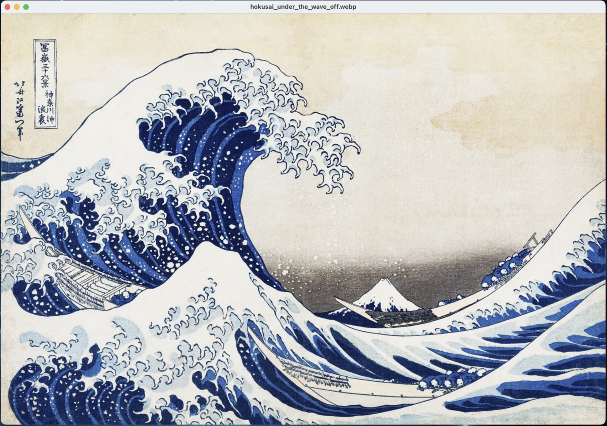
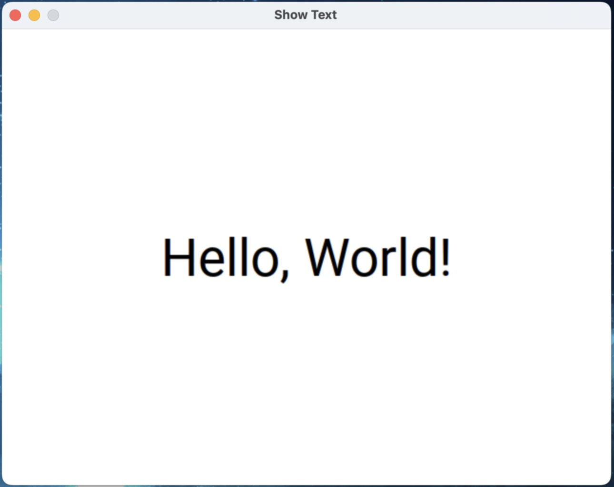
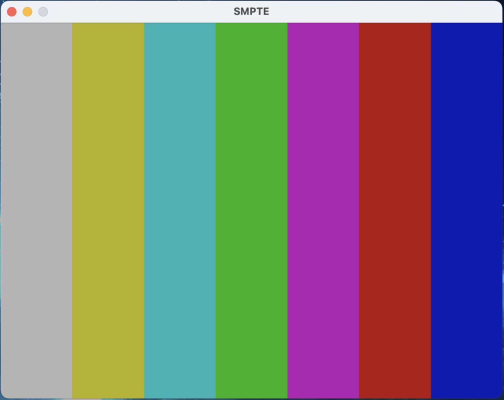

# SDLit Examples

Collection of small application to demonstrate SDLit usage.

To run them, enable building them using build\_example option:
```bash
meson setup builddir --reconfigure --buildtype=release -Dexample=enabled

meson compile -C builddir
```

## Play Music

```bash
./builddir/play_music <Music>
```

## Play Chunk

```bash
./builddir/play_chunk <Music>
```

## Image Viewer

```bash
./builddir/image_viewer <Image>
```



## Show Text

```bash
./builddir/show_text <Message> <Font File>.ttf <Font Size>
```



## SMPTE Test

```bash
./builddir/smpte_test
```


